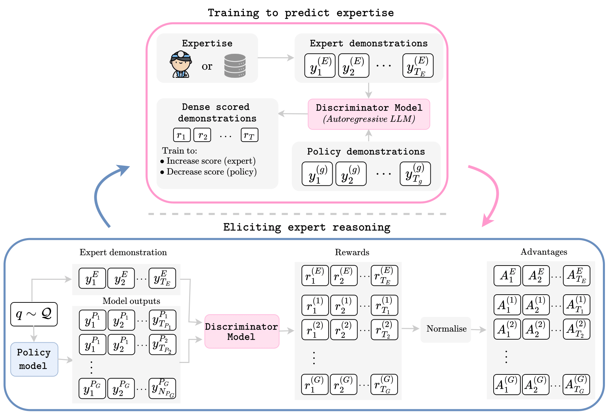

# Learning a Dense Reasoning Reward Model from Expert Demonstration via Inverse Reinforcement Learning

<div align="left">

</div>

## Abstract
We reframe and operationalise adversarial inverse reinforcement learning (IRL) to large language model reasoning, learning a dense, token-level reward model for process supervision directly from expert demonstrations rather than imitating style via supervised fine-tuning. The learned reasoning reward serves two complementary roles: (i) it provides step-level feedback to optimise a reasoning policy during training; and (ii) it functions at inference as a calibrated critic to rerank sampled traces under fixed compute budgets. We demonstrate that our approach prioritises correctness over surface form, yielding scores that correlate with eventual answer validity and enabling interpretable localisation of errors within a trace. Empirically, on GSM8K with Llama3 and Qwen2.5 backbones, we demonstrate: (i) dense reasoning rewards that track learning progress and improve evaluation correctness, and (ii) predictive performance improvements from reward-guided reranking under fixed compute budget (notably for Llama-based policies). By unifying training signals, inference-time selection, and token-level diagnostics into a single reasoning reward, this work suggests reusable process-level rewards with broad potential to enhance multi-step reasoning in language models.


## Getting Started


### Installation

1. Clone the repository and navigate to the project directory:
```bash
git clone <repository_url>
cd <repository_name>
```

2. Create and activate a virtual environment with required dependencies:
```bash
conda env create -f environment.yaml
conda activate unsloth_env
```

## Repository Setup

```
my_repo/
├── configs/
│   ├── llama3b/                      # Llama3.2 3B experiments
│   ├── llama8b/                      # Llama3.1 8B experiments
│   ├── qwen3b/                       # Qwen2.5 7B experiments
│   ├── qwen7b/                       # Qwen2.5 7B experiments
│   ├── qwen7b-dscriminator/          # Discriminator Experiment
│   ├── config_eval.yaml
│   ├── config_irl_eval.yaml
│   ├── config_irl_train.yaml
│   ├── config_irl_train.yaml
│   └── config_train.yaml
├── data/
│   ├── countdown                     # Not used, future work
│   └── medical-o1                    # Not used, future work
├── figures/                          # Source to create figures and results
├── runner_scripts/                   # Scripts to run experiment with unsloth on single A100 GPU
├── src/
│   ├── config/                       # config file for the AIRL method
│   ├── data/                         # Data loaders 
│   ├── eval/                         # Evaluation callbacks
│   ├── models/                       # Model modules
│   ├── rewards/                      # Verifiable rewards for GRPO and evaluation
│   ├── training/                     # TRainer module --> AIRL.py is where the magic happens!
│   └── utils/                        # utils
├── evaluate_irl.py
├── evaluate.py
├── irl_train.py
├── sft_train.py
└── train.py
```
## Reproduce Experiments
We recommend using 1 A100 for each experiment. With the `runner_script` you can start these isolated, and then parallelise.

### Standard Experiments

#### Llama-3.2-3B -> Llama-3.2-1B

```bash
#AIRL
bash runner_scripts/0_run_gpu_node.sh sft_train.py --config-path=configs/llama3b --config-name=3B_1B_config_irl_train
bash runner_scripts/0_run_gpu_node.sh evaluate.py --config-path=configs/llama3b --config-name=3B_1B_config_eval

# SFT
bash runner_scripts/0_run_gpu_node.sh sft_train.py --config-path=configs/llama3b --config-name=sft_3B_config_train
bash runner_scripts/0_run_gpu_node.sh evaluate.py --config-path=configs/llama3b --config-name=sft_3B_config_eval

# GRPO
bash runner_scripts/0_run_gpu_node.sh train.py --config-path=configs/llama3b --config-name=grpo_3B_config_train
bash runner_scripts/0_run_gpu_node.sh evaluate.py --config-path=configs/llama3b --config-name=grpo_3B_config_eval
```

#### Llama-3.1-8B -> Llama-3.2-15B

```bash
#AIRL
bash runner_scripts/0_run_gpu_node.sh sft_train.py --config-path=configs/llama8b --config-name=3B_1B_config_irl_train
bash runner_scripts/0_run_gpu_node.sh evaluate.py --config-path=configs/llama8b --config-name=3B_1B_config_eval

# SFT
bash runner_scripts/0_run_gpu_node.sh sft_train.py --config-path=configs/llama8b --config-name=sft_8B_config_train
bash runner_scripts/0_run_gpu_node.sh evaluate.py --config-path=configs/llama8b --config-name=sft_8B_config_eval

# GRPO
bash runner_scripts/0_run_gpu_node.sh train.py --config-path=configs/llama8b --config-name=grpo_8B_config_train
bash runner_scripts/0_run_gpu_node.sh evaluate.py --config-path=configs/llama8b --config-name=grpo_8B_config_eval
```

#### Qwen2.5-3B-> Qwen2.5-0.5B

```bash
#AIRL
bash runner_scripts/0_run_gpu_node.sh sft_train.py --config-path=configs/qwen3b --config-name=3B_1B_config_irl_train
bash runner_scripts/0_run_gpu_node.sh evaluate.py --config-path=configs/qwen3b --config-name=3B_1B_config_eval

# SFT
bash runner_scripts/0_run_gpu_node.sh sft_train.py --config-path=configs/qwen3b --config-name=sft_3B_config_train
bash runner_scripts/0_run_gpu_node.sh evaluate.py --config-path=configs/qwen3b --config-name=sft_3B_config_eval

# GRPO
bash runner_scripts/0_run_gpu_node.sh train.py --config-path=configs/qwen3b --config-name=grpo_3B_config_train
bash runner_scripts/0_run_gpu_node.sh evaluate.py --config-path=configs/qwen3b --config-name=grpo_3B_config_eval
```

####  Qwen2.5-7B-> Qwen2.5-1.5B

```bash
#AIRL
bash runner_scripts/0_run_gpu_node.sh sft_train.py --config-path=configs/qwen7b --config-name=7B_1B_config_irl_train
bash runner_scripts/0_run_gpu_node.sh evaluate.py --config-path=configs/qwen7b --config-name=7B_1B_config_eval

# SFT
bash runner_scripts/0_run_gpu_node.sh sft_train.py --config-path=configs/qwen7b --config-name=sft_7B_config_train
bash runner_scripts/0_run_gpu_node.sh evaluate.py --config-path=configs/qwen7b --config-name=sft_7B_config_eval

# GRPO
bash runner_scripts/0_run_gpu_node.sh train.py --config-path=configs/qwen7b --config-name=grpo_7B_config_train
bash runner_scripts/0_run_gpu_node.sh evaluate.py --config-path=configs/qwen7b --config-name=grpo_7B_config_eval
```

### No Perturbation

#### Llama-3.2-3B -> Llama-3.2-1B

```bash
#AIRL
export OVERRIDE="wandb.run_name=llama3b_airl_noper model.num_neg_perturbations_per_expert=0"
bash runner_scripts/0_run_gpu_node.sh sft_train.py --config-path=configs/llama3b --config-name=3B_1B_config_irl_train $OVERRIDE
export OVERRIDE="wandb.run_name=llama3b_airl_noper"
bash runner_scripts/0_run_gpu_node.sh evaluate.py --config-path=configs/llama3b --config-name=3B_1B_config_eval $OVERRIDE
```

#### Llama-3.1-8B -> Llama-3.2-15B

```bash
#AIRL
export OVERRIDE="wandb.run_name=llama8b_airl_noper model.num_neg_perturbations_per_expert=0"
bash runner_scripts/0_run_gpu_node.sh sft_train.py --config-path=configs/llama8b --config-name=3B_1B_config_irl_train $OVERRIDE
export OVERRIDE="wandb.run_name=llama8b_airl_noper"
bash runner_scripts/0_run_gpu_node.sh evaluate.py --config-path=configs/llama8b --config-name=3B_1B_config_eval $OVERRIDE
```

#### Qwen2.5-3B-> Qwen2.5-0.5B

```bash
#AIRL
export OVERRIDE="wandb.run_name=qwen3b_airl_noper model.num_neg_perturbations_per_expert=0"
bash runner_scripts/0_run_gpu_node.sh sft_train.py --config-path=configs/qwen3b --config-name=3B_1B_config_irl_train $OVERRIDE
export OVERRIDE="wandb.run_name=qwen3b_airl_noper"
bash runner_scripts/0_run_gpu_node.sh evaluate.py --config-path=configs/qwen3b --config-name=3B_1B_config_eval $OVERRIDE

```

####  Qwen2.5-7B-> Qwen2.5-1.5B

```bash
#AIRL
export OVERRIDE="wandb.run_name=qwen7b_airl_noper model.num_neg_perturbations_per_expert=0"
bash runner_scripts/0_run_gpu_node.sh sft_train.py --config-path=configs/qwen7b --config-name=7B_1B_config_irl_train $OVERRIDE
export OVERRIDE="wandb.run_name=qwen7b_airl_noper"
bash runner_scripts/0_run_gpu_node.sh evaluate.py --config-path=configs/qwen7b --config-name=7B_1B_config_eval $OVERRIDE
```


### WGAN

#### Llama-3.2-3B -> Llama-3.2-1B

```bash
#AIRL
export OVERRIDE="wandb.run_name=llama3b_airl_wgan model.classifier_loss=wgan"
bash runner_scripts/0_run_gpu_node.sh sft_train.py --config-path=configs/llama3b --config-name=3B_1B_config_irl_train $OVERRIDE
export OVERRIDE="wandb.run_name=llama3b_airl_wgan"
bash runner_scripts/0_run_gpu_node.sh evaluate.py --config-path=configs/llama3b --config-name=3B_1B_config_eval $OVERRIDE
```

#### Llama-3.1-8B -> Llama-3.2-15B

```bash
#AIRL
export OVERRIDE="wandb.run_name=llama8b_airl_wgan model.classifier_loss=wgan"
bash runner_scripts/0_run_gpu_node.sh sft_train.py --config-path=configs/llama8b --config-name=3B_1B_config_irl_train $OVERRIDE
export OVERRIDE="wandb.run_name=llama8b_airl_wgan"
bash runner_scripts/0_run_gpu_node.sh evaluate.py --config-path=configs/llama8b --config-name=3B_1B_config_eval $OVERRIDE
```

#### Qwen2.5-3B-> Qwen2.5-0.5B

```bash
#AIRL
export OVERRIDE="wandb.run_name=qwen3b_airl_wgan model.classifier_loss=wgan"
bash runner_scripts/0_run_gpu_node.sh sft_train.py --config-path=configs/qwen3b --config-name=3B_1B_config_irl_train $OVERRIDE
export OVERRIDE="wandb.run_name=qwen3b_airl_wgan"
bash runner_scripts/0_run_gpu_node.sh evaluate.py --config-path=configs/qwen3b --config-name=3B_1B_config_eval $OVERRIDE

```

####  Qwen2.5-7B-> Qwen2.5-1.5B

```bash
#AIRL
export OVERRIDE="wandb.run_name=qwen7b_airl_wgan model.classifier_loss=wgan"
bash runner_scripts/0_run_gpu_node.sh sft_train.py --config-path=configs/qwen7b --config-name=7B_1B_config_irl_train $OVERRIDE
export OVERRIDE="wandb.run_name=qwen7b_airl_wgan"
bash runner_scripts/0_run_gpu_node.sh evaluate.py --config-path=configs/qwen7b --config-name=7B_1B_config_eval $OVERRIDE
```