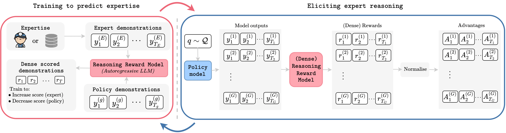

# Learning Reasoning Reward Models from Expert Demonstration via Inverse Reinforcement Learning

<div align="left">

</div>

## Abstract
Teaching large language models (LLMs) to reason during post-training typically relies on reinforcement learning with explicit outcome- or process-based reward functions. However, in many real-world settings, obtaining or defining such reward functions is difficult, especially for complex tasks, making learning from expert demonstrations an attractive alternative. The dominant approach, supervised fine-tuning (SFT), trains models to imitate expert reasoning traces directly, but suffers from the general limitations of off-policy learning: performance can be fragile to inference-time deviations from states explicitly covered by the demonstrations. To address this, we propose \textbf{Reasoning Adversarial Inverse Reinforcement Learning (R-AIRL)}. Rather than imitating the expert’s reasoning, R-AIRL infers the underlying process-level reward from the expert Chain-of-Thoughts. Through experiments on GSM8K, MMLU-Pro and MedReason we show that the reasoning reward function learned with R-AIRL can be effectively used throughout the training and inference pipeline: (1) to provide a training signal for \textbf{post-training}, outperforming SFT in most of the considered settings, (2) for \textbf{inference-time reranking}, improving pass@1 by up to 17.4 points, and (3) for \textbf{process-level evaluation}, localising reasoning failures with up to 86.1\% accuracy. Overall, R-AIRL bridges imitation learning and reward-based optimisation, enabling the extraction of meaningful reasoning signals from expert thinking traces.

## What This Repo Covers
- AIRL-style reasoning reward learning (sparse / partial-step / interval / dense variants)
- Policy training baselines: AIRL, SFT, GRPO
- Evaluation and reranking analyses for GSM8K, MedReason, MMLU(-Pro), and AIME variants
- Plot/table generation for pass@k, reranking, calibration, and token-level diagnostics

## Repository Layout
- `train_irl.py`, `train_sft.py`, `train_grpo.py`: training entrypoints
- `evaluate.py`: unified evaluation entrypoint (see `docs/EVALUATION_GUIDE.md`)
- `configs/`: training/eval configs (see `configs/README.md`)
- `src/`: implementation modules (models, training, rewards, plotting, data)
- `src/plot_generators/configs/`: YAML specs for plotting runs
- `runner_scripts/`: multi-GPU experiment orchestration scripts used for paper-scale runs
- `figures/`: generated outputs and historical artifacts (see `figures/README.md`)

## Setup
```bash
conda env create -f environment.yaml
conda activate unsloth_env
```

## Data and Paths
Many configs reference cluster paths under `/mnt/pdata/...`. For local runs, override paths at launch time (especially `training.output_dir` and any dataset/model path overrides).

## How Experiments Were Run (NeurIPS Archive)
This repository contains both:
- single-run Hydra entrypoints (`train_*.py`, `evaluate.py`) for local debugging
- paper-scale orchestration scripts under `runner_scripts/` (multi-GPU, staged pipeline)

The archived paper outputs are in `figures/archive/`, and the paper PDF is stored as:
- `figures/archive/NeurIPS_expert_reasoning (1).pdf`

### 1) Single-Run Commands (Local Smoke Tests)
Examples (Hydra-based):

```bash
# AIRL (example: math / qwen7b)
python train_irl.py --config-path=configs/math/qwen7b --config-name=irl_train \
  wandb.run_name=qwen7b_partial_fixed \
  model.dense_rewards=partial_fixed \
  training.output_dir=./outputs/qwen7b_partial_fixed

# SFT
python train_sft.py --config-path=configs/math/qwen7b --config-name=sft_train \
  wandb.run_name=qwen7b_sft \
  training.output_dir=./outputs/qwen7b_sft

# GRPO
python train_grpo.py --config-path=configs/math/qwen7b --config-name=grpo_train \
  wandb.run_name=qwen7b_grpo \
  training.output_dir=./outputs/qwen7b_grpo
```

### 2) Paper-Scale Training (Multi-GPU)
The main training sweep is orchestrated by:
- `runner_scripts/super_runners/{0,1,2,3}_superrunner.sh`

These scripts call `train_sft.py`, `train_irl.py`, and `evaluate.py` through:
- `runner_scripts/{0,1,2,3}_run_gpu_node.sh`

Launch one script per GPU:

```bash
bash runner_scripts/super_runners/0_superrunner.sh
bash runner_scripts/super_runners/1_superrunner.sh
bash runner_scripts/super_runners/2_superrunner.sh
bash runner_scripts/super_runners/3_superrunner.sh
```

Notes:
- edit `ASSIGNED_*` lists / `run_combo` lines in each script to control which dataset-model pairs are run
- scripts are intentionally editable templates for cluster runs
- `runner_scripts/retakes/` contains late-stage reruns (including partial-fixed/GRPO retakes)

### 3) Standard Eval Sweep (Temperature 0.5)
Evaluate all trained checkpoints (SFT/GRPO/AIRL variants):

```bash
bash runner_scripts/eval_all_temp05/0_evaluator.sh
bash runner_scripts/eval_all_temp05/1_evaluator.sh
bash runner_scripts/eval_all_temp05/2_evaluator.sh
bash runner_scripts/eval_all_temp05/3_evaluator.sh
```

### 4) Reranking + SFT-Trace Scoring
Run AIRL reward scoring on SFT traces and policy log-prob extraction:

```bash
bash runner_scripts/sft_reranking_temp05/0_evaluator.sh
bash runner_scripts/sft_reranking_temp05/1_evaluator.sh
bash runner_scripts/sft_reranking_temp05/2_evaluator.sh
bash runner_scripts/sft_reranking_temp05/3_evaluator.sh

bash runner_scripts/sft_reranking_temp05/0_logprobs.sh
bash runner_scripts/sft_reranking_temp05/1_logprobs.sh
bash runner_scripts/sft_reranking_temp05/2_logprobs.sh
bash runner_scripts/sft_reranking_temp05/3_logprobs.sh
```

### 5) Transferability Sweep
Cross-domain policy/reward transfer experiments are under:
- `runner_scripts/transferability_temp05/`

Common launch pattern:

```bash
# Optional: choose dense mode
export DENSITY=partial_fixed

bash runner_scripts/transferability_temp05/first_0_runner.sh
bash runner_scripts/transferability_temp05/first_1_runner.sh
bash runner_scripts/transferability_temp05/2_runner.sh
bash runner_scripts/transferability_temp05/3_runner.sh
```

### 6) Plot and Table Generation
Main paper figures/tables:

```bash
python src/plot_generators/plot_main.py \
  --config src/plot_generators/configs/main.yaml \
  --workers 8

python src/plot_generators/plot_transfer.py \
  --config src/plot_generators/configs/transfer.yaml \
  --workers 8
```

To regenerate into the archive folder directly:

```bash
python src/plot_generators/plot_main.py \
  --config src/plot_generators/configs/main.yaml \
  --output-root figures/archive \
  --workers 8
```

Useful flags:
- `--ckpt <name>`: override checkpoint folder (default: `best_model`)
- `--output-root <path>`: override output root directory
- `--no-token-figs`: skip expensive token-level visualizations
- `--debug`: run sequentially (easier debugging)

## Evaluation
```bash
# AIRL evaluation
python evaluate.py --config-path=configs/math/qwen7b --config-name=irl_eval

# SFT evaluation
python evaluate.py --config-path=configs/math/qwen7b --config-name=sft_eval

# GRPO evaluation
python evaluate.py --config-path=configs/math/qwen7b --config-name=grpo_eval

# AIME-style output filename (legacy evaluate_aime behavior)
python evaluate.py --config-path=configs/aime/qwen3b --config-name=irl_eval eval.mode=aime

# Pregenerated completions + policy log-probs (legacy evaluate_pregenerated behavior)
python evaluate.py --config-path=configs/math/qwen7b --config-name=irl_eval eval.mode=pregenerated_policy

# Pregenerated completions + policy + reward model (legacy evaluate_pregenerated_sft behavior)
python evaluate.py --config-path=configs/math/qwen7b --config-name=irl_eval eval.mode=pregenerated_policy_and_reward
```

See `docs/EVALUATION_GUIDE.md` for full mode details, jsonl input resolution rules, and output naming.

