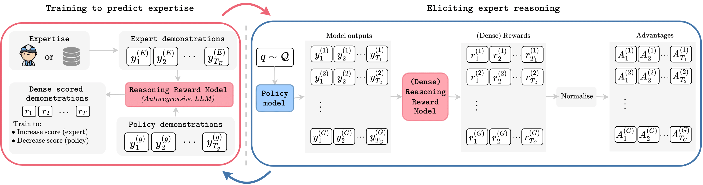

# Expert Reasoning Reward Models

Code for the paper on learning process-level reasoning reward models from
expert demonstrations and using them for post-training, inference-time
reranking, and reasoning-error localisation.

The codebase supports AIRL/ReGAIL-style reward learning from expert reasoning
traces, SFT and GRPO baselines, reranking analyses, and token-level localisation
experiments on GSM8K, MedReason, MMLU-Pro, and related evaluation sets.

<div align="left">

</div>

## Layout

- `train_irl.py`, `train_sft.py`, `train_grpo.py`: training entrypoints.
- `evaluate.py`: unified evaluation entrypoint; see `docs/EVALUATION_GUIDE.md`.
- `configs/`: Hydra configs for math, medicine, MMLU, ScienceQA-style runs.
- `src/`: model, reward, training, evaluation, data, and table-generation code.
- `runner_scripts/`: cleaned cluster scripts for paper-scale runs, ablations,
  reranking, and localisation.
- `figures/`: generated tables and plots.
- `localisation/`: process-level localisation experiments.
- `localisation/clinician_medreason/`: cleaned anonymised clinician-labelled
  MedReason localisation study.
- `localisation/synthetic_perturbations/`: controlled GSM8K perturbation
  localisation study from the appendix.

Many paper-scale configs reference cluster paths under `/mnt/pdata/...`.
Override dataset, checkpoint, and output paths when running elsewhere.

## Setup

```bash
conda env create -f environment.yaml
conda activate unsloth_env
```

If you use the current local environment instead of the full conda spec,
`requirements-uv-current.txt` records the packages installed for the latest
analysis runs.

## Training

Single-run examples:

```bash
# Reward model / IRL training
python train_irl.py --config-path=configs/math/qwen7b --config-name=irl_train \
  wandb.run_name=qwen7b_partial_fixed \
  model.dense_rewards=partial_fixed \
  training.output_dir=./outputs/qwen7b_partial_fixed

# Supervised fine-tuning
python train_sft.py --config-path=configs/math/qwen7b --config-name=sft_train \
  wandb.run_name=qwen7b_sft \
  training.output_dir=./outputs/qwen7b_sft

# GRPO baseline
python train_grpo.py --config-path=configs/math/qwen7b --config-name=grpo_train \
  wandb.run_name=qwen7b_grpo \
  training.output_dir=./outputs/qwen7b_grpo
```

Paper-scale sweeps are orchestrated by scripts under `runner_scripts/`; see
`runner_scripts/README.md` for the cleaned map. Legacy scratch launchers are
archived locally under `runner_scripts/_backup_not_committed/`.

## Evaluation And Reranking

```bash
# Reward-model evaluation
python evaluate.py --config-path=configs/math/qwen7b --config-name=irl_eval

# SFT evaluation
python evaluate.py --config-path=configs/math/qwen7b --config-name=sft_eval

# GRPO evaluation
python evaluate.py --config-path=configs/math/qwen7b --config-name=grpo_eval

# Pregenerated completions with policy and reward scores
python evaluate.py --config-path=configs/math/qwen7b --config-name=irl_eval \
  eval.mode=pregenerated_policy_and_reward
```

Main paper table and figure generation:

```bash
python src/plot_generators/plot_main.py \
  --config src/plot_generators/configs/main.yaml \
  --workers 8

python src/plot_generators/plot_transfer.py \
  --config src/plot_generators/configs/transfer.yaml \
  --workers 8
```

## Clinician Localisation

The cleaned MedReason clinician study has one public runner and anonymised JSONL
labels:

```bash
python localisation/clinician_medreason/run_experiment.py
```

Inputs:

- `localisation/clinician_medreason/annotations/expert_*.jsonl`
- `localisation/clinician_medreason/metadata/clinician_cases.jsonl`
- external token-level score JSONLs under the paths documented in
  `localisation/clinician_medreason/README.md`

Outputs:

- `localisation/clinician_medreason/results/clinician_localisation_metrics.md`
- `localisation/clinician_medreason/results/clinician_localisation_metrics.json`

The metric is Hit@1 and Hit@+/-1 over clinician-visible reasoning units, with
no-clear and final-answer-only labels mapped to the final visible reasoning
unit.

## Synthetic Perturbation Localisation

The controlled GSM8K localisation experiment from Section 5.2 and Appendix D.5
is collected under `localisation/synthetic_perturbations/`:

```bash
bash localisation/synthetic_perturbations/run_experiment.sh
```

This regenerates the synthetic Hit@1/Hit@7 tables from the compact run
summaries and writes them to `localisation/synthetic_perturbations/results/`.

## Notes

Large raw JSONL traces, logs, smoke outputs, and score dumps are intentionally
ignored. The repository should keep scripts, configs, compact summaries, and
anonymised labels; regenerate large intermediates from the runner scripts when
needed.
